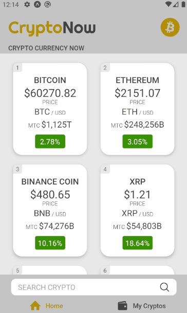
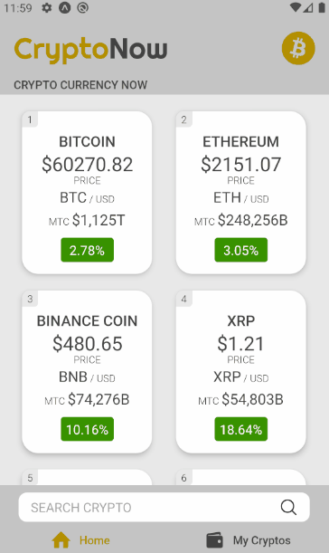

# CryptoNow :construction:

CryptoNow é um projeto pessoal desenvolvido em React Native, que partiu da necessidade de acompanhar as variações de mercado das criptomoedas em geral. Através da API do
CoinMarketCap foi possível consumir os dados das Cryptos.

Para a prototipagem do do projeto, utilizei o ***Figma***. Nesse projeto utilizei funcionalidades nativas do React Native como: ***Animated API*** e ***Context API***(compartilhamento de estados).

# Technologies
- React Native
- Styled Components

# Working
### Function Search Crypto

### Function Favorite Crypto

### Infinity Scroll

